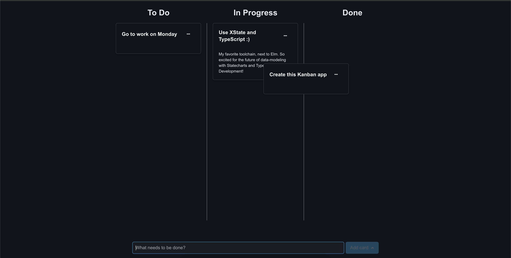
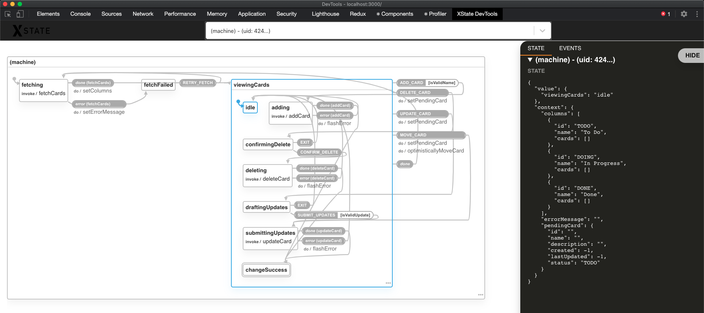

# KanbanDB App

## Hey there! 😁

Thank you for this challenge, I had fun doing it.

### App Screenshot ([Click here for demo](https://www.yazeedb.com/kanban-app/))

### My Statechart (app logic visualized)

I noticed your original mockup mentioned XState, which I love and used for this project!

### Features

1. Three columns to place your tasks (**To Do**, **In Progress**, **Done**).

2. Uses KanbanDB for all "database" operations.

3. You can create cards in two ways

   - Type something and hit **Enter**. This automatically puts it in **To Do**.

   - Type something and click **Add card**. This lets you choose your column up front.

4. Drag and drop cards between columns (uses react-beautiful-dnd) with optimistic rendering for a snappy, real-time UX.

5. If a network requests fails after moving a card, the statechart will automatically try to refresh the data.

6. Delete a card, with a prompt confirming if you're sure.

7. Update a card's name/description, with basic form validation.

### Tools used

1. TypeScript for first-class data modeling with compile-time assistance.
2. XState to create deterministic, visualizable business logic.
3. react-beautiful-dnd for awesome and accessible drag and drop.
4. React Suite for a quick and professional look.
5. Scss for variables and nesting.
